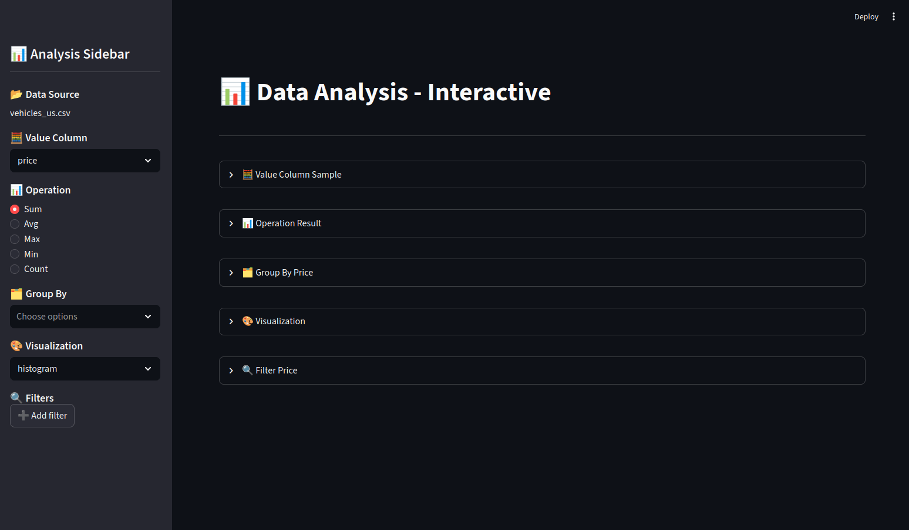
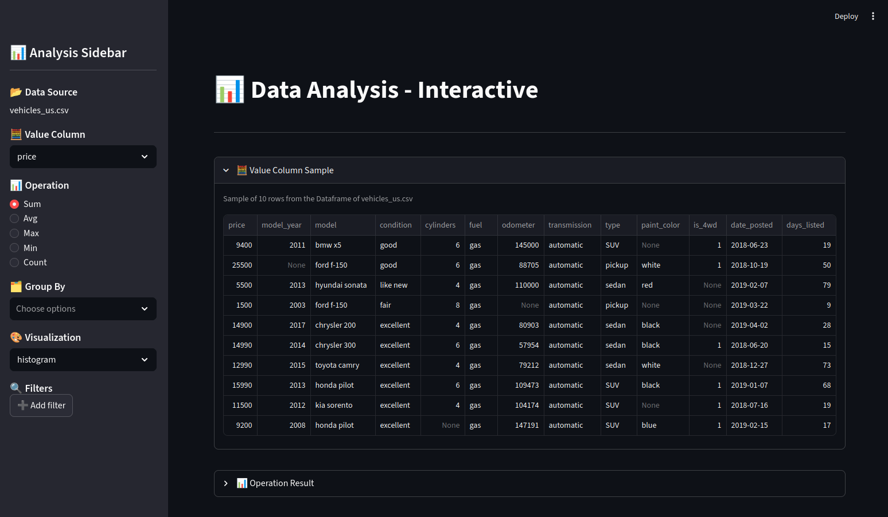
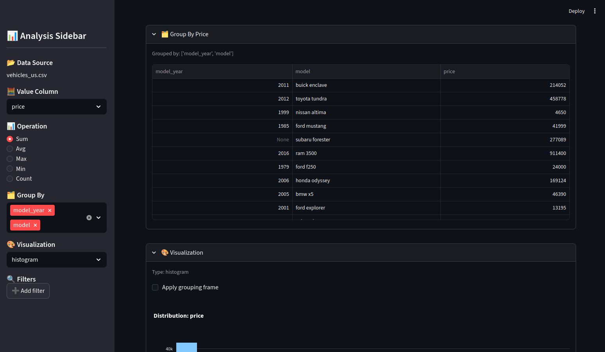
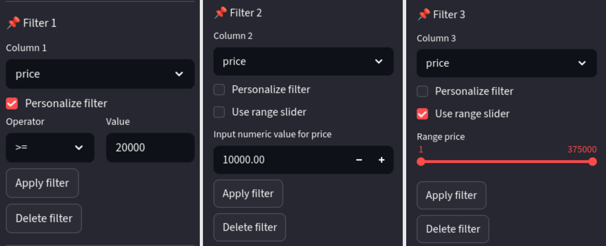
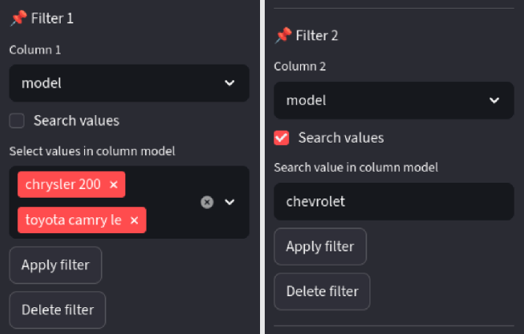
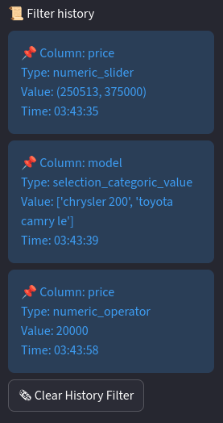

# 📊 Auto Insight Dual Analysis Tool

[](https://python.org)
[](https://pola.rs)
[](https://streamlit.io)
[](https://plotly.com)
[](https://docs.pydantic.dev)
[](https://opensource.org/licenses/MIT)

## 🎯 What Problem Does It Solve?

Have you ever found yourself...

- 📉 Staring at a CSV with no idea where to start analyzing?
- 🔍 Wanting to explore data quickly but finding pandas filters tedious?
- 📊 Needing automated insights without writing code every single time?
- 🎨 Frustrated with static visualizations that don't let you interact with your data?

**Auto Insight Dual Analysis Tool** was born to solve exactly that: **a dual tool** that combines the best of both worlds:

### 🔬 **Mode 1: Automated Analysis** -> For when you need quick answers

Load your CSV, configure what you want to analyze (or leave it on auto), and get:

- Complete terminal report with key insights
- Interactive visualizations saved as HTML
- JSON with all findings structured
- Intelligent detection of outliers, distributions, and correlations

### 🎮 **Mode 2: Interactive Exploration** -> For when you want to play with your data

A Streamlit app that lets you:

- Dynamic filters without writing code
- On-the-fly operations (sum, average, count...)
- Multiple groupings with a single click
- Real-time updating visualizations
- Filter history to keep track

App Link: https://prism-77em.onrender.com

## 🚀 Quick Example

### **With 3 lines in your terminal:**

```bash
    # 1. Configure (or use defaults)
    # 2. Run
    python main.py
    # 3. Get (example output):
    === AUTOMATED INSIGHTS REPORT ===
    Dataset: vehicles_us.csv
    Columns: ['price', 'model_year', 'model', 'condition', 'cylinders', 'fuel', 'odometer', 'transmission', 'type', 'paint_color', 'is_4wd', 'date_posted', 'days_listed']
    
    1. 📈 DISTRIBUTION
    - price: mean=12132.46, median=9000.0, std=10040.80, positive skew
    - Plot: /home/arbolitos7/Documents/TripleTen/Sprint7/Sprint7/analysis_report/analysis_2026-02-25/distribution/distribution_price.html
    - model_year: mean=2009.75, median=2011.0, std=6.28, negative skew
    - Plot: /home/arbolitos7/Documents/TripleTen/Sprint7/Sprint7/analysis_report/analysis_2026-02-25/distribution/distribution_model_year.html
    - ...
    
    2. ⚠️ OUTLIERS
    - price: 1646 outliers → (3.19%)
    - Sample: /home/arbolitos7/Documents/TripleTen/Sprint7/Sprint7/analysis_report/analysis_2026-02-25/outliers/outliers_price.html
    - model_year: 709 outliers → (1.38%)
    - Sample: /home/arbolitos7/Documents/TripleTen/Sprint7/Sprint7/analysis_report/analysis_2026-02-25/outliers/outliers_model_year.html
    - ...

    3. 🔗 CORRELATION
    - Invalid correlation detected: The columns ['price', 'model_year', 'cylinders', 'odometer', 'is_4wd', 'days_listed'] have zero standard deviation or is zero

    4. 🏷️ CATEGORIES
    - model: top labels= ['ford f-150', 'chevrolet silverado 1500', 'ram 1500', 'chevrolet silverado', 'jeep wrangler', 'ram 2500', 'toyota camry', 'honda accord', 'chevrolet silverado 2500hd', 'gmc sierra 1500']
    - model: 69 rare categories (<1.0%)
    - condition: top labels= ['excellent', 'good', 'like new', 'fair', 'new', 'salvage']
    - condition: 2 rare categories (<1.0%)
    - ...
```

### **With 1 command in your terminal:**

```bash
    streamlit run app.py
```

## 🧠 How Does DataAnalysis Think?

### **1. Contextual Intelligence**

It's not a simple script: **it understands data types** and acts accordingly:

| Context 	             | Behavior                                                               |
|------------------------|------------------------------------------------------------------------|
| **Numeric column**	 | Offers sum, avg, max, min, count + boxplot, histogram                  | 
| **Categorical column** | Offers count, unique + histogram                                       |
| **Heatmap**	         | If 1 column selected, auto-takes all numeric columns or you can choose |
| **Numeric filter**	 | Detects range and offers slider or operators                           |
| **Categorical filter** | Shows unique values for selection or search                            |

### **2. Auto-Detection of Insights**

In automated mode, if you don't specify columns:

| Insight	       | If no columns specified                        |
| -----------------|------------------------------------------------|
| **Distribution** | Analyzes ALL columns                           |
| **Outliers**	   | Takes all NUMERIC columns                      |
| **Correlation**  | Requires ≥2 numeric columns, if not → disabled |
| **Categories**   | Takes all CATEGORICAL columns                  |

## 🎨 Interactive App Tour (example)



### 📍 **Sidebar: Your Control Center**

| Section	           | What it does	            | Example                    |
|----------------------|----------------------------|----------------------------|
| 📂 **Data Source**   | Shows current file	        | vehicles_us.csv            |
| 🧮 **Value Column**  | Column to analyze (single) | price, model, condition    | 
| 📊 **Operation**	   | Operation based on type	| Sum, Avg, Count, Unique    |
| 🗂️ **Group By**	    | Multiple grouping	         | model_year + model         |
| 🎨 **Visualization** | Chart type	                | histogram, boxplot, heatmap|
| 🔍 **Filters**	   | Dynamic filters	        | sliders, operators, search |

### 🎯 **Main Panel**

#### 1. Data Preview

```python
    # Always see the first 10 rows for context
    frame.head(10)
```

#### 2. Real-Time Results



#### 3. Interactive Groupings

When you group, you get a DataFrame like this:



And a checkbox for **"Apply grouping frame"** that decides whether the chart respects the grouping.

#### 4. Professional Filter System

**Numeric Filters:**

- 🎚️ Slider: Continuous range (min, max)
- ➕ Operators: >, >=, <, <=, = with value
- 🔍 Search: Type exact value



**Categorical Filters:**

- 🔍 Search: Type exact value
- ✅ Multiple selection: Choose from existing values



**History with timestamp:**



## 📁 Organized Output

Each analysis generates its own dated folder:

```text
        analysis_report/
    ├── analysis_2026-02-11/
    │   ├── distribution/
    │   │   ├── distribution_price.html    
    │   │   ├── distribution_model.html     
    │   │   └── ...
    │   ├── outliers/
    │   │   ├── outliers_price.html         
    │   │   └── ...
    │   └── correlation/
    │       └── correlation_matrix.html     
    └── json_analysis/
        └── insights_2026-02-11.json        
```

## 🛠️ Tech Stack

| Technology	| Why We Chose It                                       |
|---------------|-------------------------------------------------------|
| **Polars**	| Fast in-memory processing, eager mode for control     |
| **Pydantic**	| Config validation with types and clear error messages |
| **Plotly**	| Interactive charts saved as HTML                      |
| **Streamlit**	| Rapid professional dashboard prototyping              |
| **YAML/TOML**	| Human-readable vs typed configuration                 |
| **Enum**	    | Extensible strategies, easy to add more               |

## 🚀 Quick Installation

```bash
    # 1. Clone
    git clone https://github.com/sm7ss/auto-insight-dual-analysis-tool.git
    cd auto-insight-dual-analysis-tool
    
    # 2. Install (recommended: virtual environment)
    python -m venv venv
    source venv/bin/activate  # or `venv\Scripts\activate` on Windows
    pip install -r requirements.txt
    
    # 3. Start analyzing!
    python main.py                    # Automated mode
    streamlit run app.py              # Interactive mode
```

## 🧪 Real Use Cases

- 📌 For Data Analysts
    - "I need to quickly understand a new dataset before presenting it to the client"

- 📌 For Data Scientists
    - I want to validate my assumptions about outliers and distributions before modeling"

- 📌 For Students
    - "I'm learning data analysis and want to experiment without coding"

- 📌 For Product Managers
    - "I need to explore product metrics without bothering the data team"

## 🎯 Next Steps (Roadmap)

- More outlier methods: Z-score, MAD, percentiles
- Support for more formats: Excel, Parquet, JSON
- Export to PDF: Reports ready to share
- Customizable themes: Dark/Light mode, corporate colors

## 👥 Contributing

Got an idea? Found a bug? This project thrives on community!

1. Fork the repo
2. Create your branch (git checkout -b feature/awesome-thing)
3. Commit (git commit -m 'Add: something awesome')
4. Push (git push origin feature/awesome-thing)
5. Open a Pull Request


